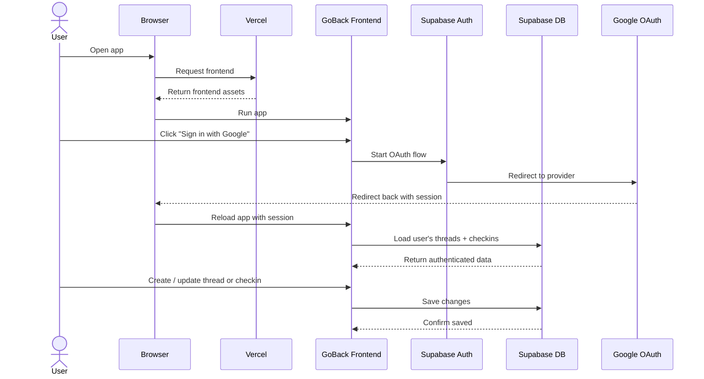

# GoBack User Sequence Diagram

```mermaid
sequenceDiagram
  actor User
  participant Browser
  participant Vercel
  participant App as GoBack Frontend
  participant Auth as Supabase Auth
  participant DB as Supabase DB
  participant Google as Google OAuth

  User->>Browser: Open app
  Browser->>Vercel: Request frontend
  Vercel-->>Browser: Return frontend assets
  Browser->>App: Run app

  User->>App: Click "Sign in with Google"
  App->>Auth: Start OAuth flow
  Auth->>Google: Redirect to provider
  Google-->>Browser: Redirect back with session

  Browser->>App: Reload app with session
  App->>DB: Load user's threads + checkins
  DB-->>App: Return authenticated data

  User->>App: Create / update thread or checkin
  App->>DB: Save changes
  DB-->>App: Confirm saved
```